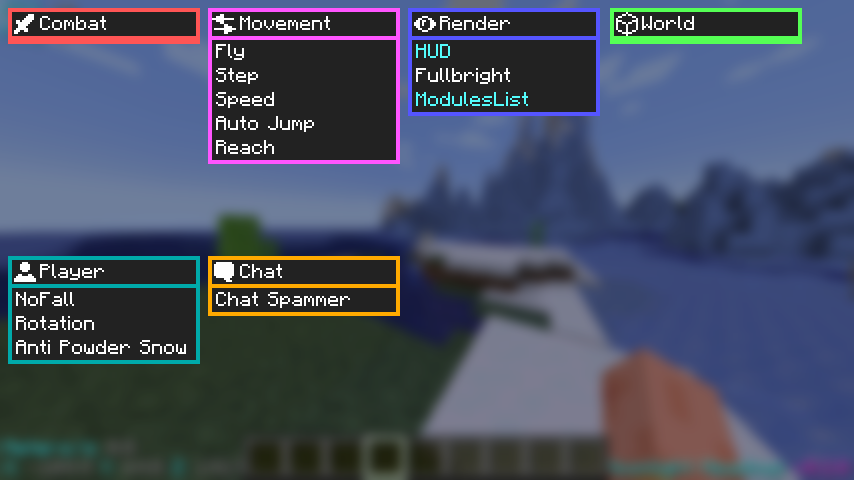

# Moonlight Meadows Utility Mod for Modern versions of Minecraft
## This repo has moved, please see https://git.kawaiizenbo.me/kawaiizenbo/MoonlightMeadows

Requires Fabric, Fabric API, and Minecraft 1.21

Default ClickGUI Key is Right Alt.

Grab the latest release build [here](https://github.com/kawaiizenbo/MoonlightMeadows/releases)  
Grab the latest nightly build [here](https://nightly.link/kawaiizenbo/MoonlightMeadows/workflows/build/main/Artifacts.zip)  

## Screenshots
  
*Title Screen*  
  
  
*In-Game HUD*  
  
  
*ClickGUI*  
  

## Disclaimer
Please use this mod at your own risk, we are not responsible for any serious injury or death caused by this mod.  
Do not use while operating heavy machinery.  
This project is not affiliated with Mojang or Microsoft.  
